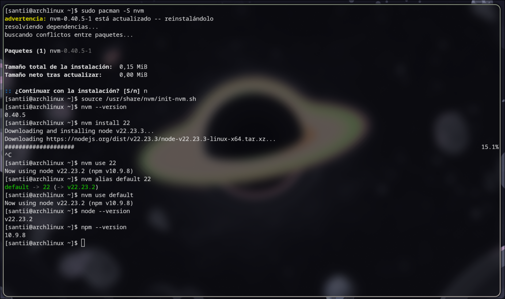
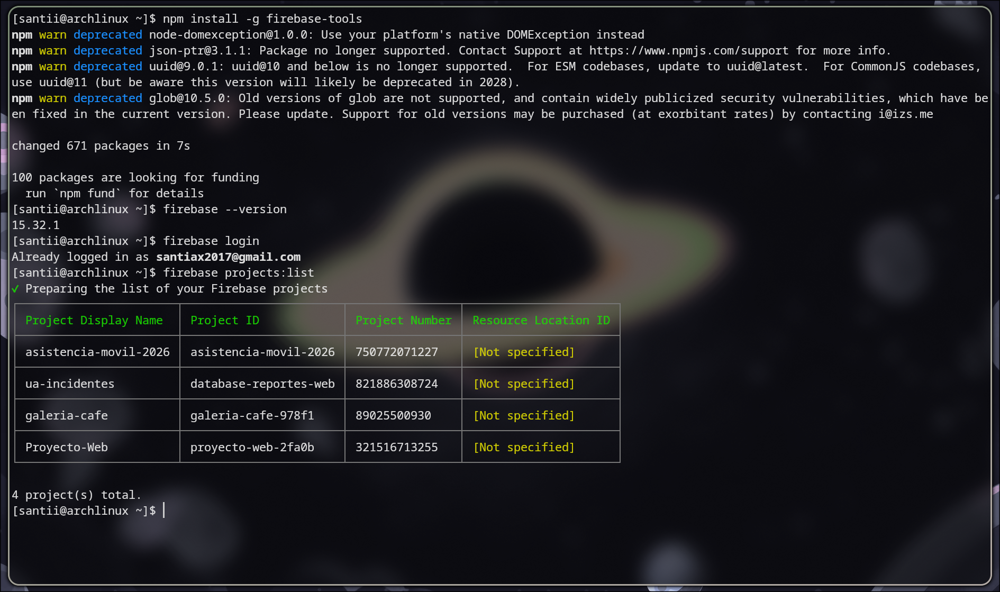
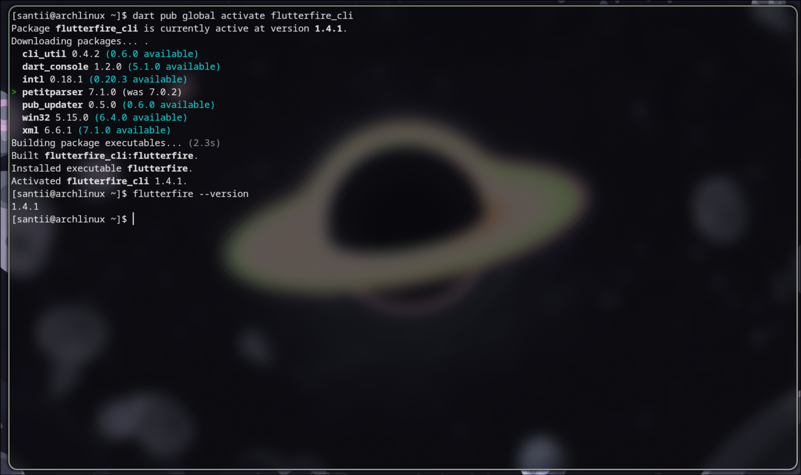
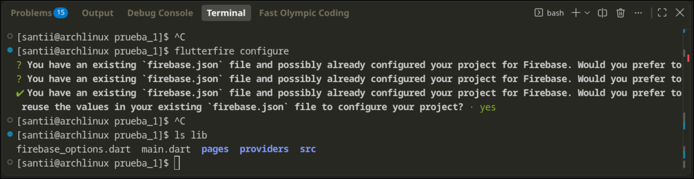
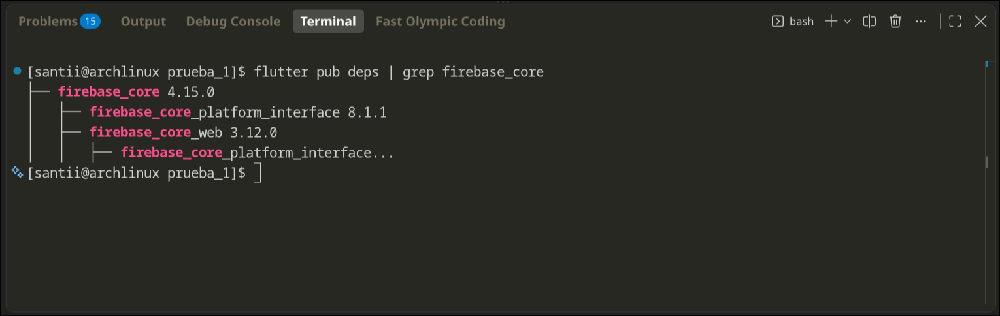

# Configuracion de  Firebase en Flutter (Linux Arch)

Configuración de Firebase para un proyecto Flutter usando Firebase CLI y FlutterFire CLI.

## 1. Instalar NVM

Al intentar instalar Firebase CLI directamente con npm aparecieron problemas con Node y permisos. Para solucionarlo se utilizó NVM con Node 22.

```bash
sudo pacman -S nvm
```

Cargar NVM:

```bash
source /usr/share/nvm/init-nvm.sh
```

Comprobar que quedó instalado:

```bash
nvm --version
```

## 2. Instalar Node 22

Instalar Node 22:

```bash
nvm install 22
```

Activarlo:

```bash
nvm use 22
```

Comprobar las versiones:

```bash
node --version
npm --version
```

Dejar Node 22 como versión predeterminada:

```bash
nvm alias default 22
nvm use default
```

Volver a comprobar:

```bash
node --version
```

> En este punto Node debe estar funcionando mediante NVM.



---

## 3. Instalar Firebase CLI

Con Node funcionando correctamente, instalar Firebase CLI:

```bash
npm install -g firebase-tools
```

Comprobar la instalación:

```bash
firebase --version
```

En este caso quedó instalada la versión:

```text
15.30.2
```

Iniciar sesión:

```bash
firebase login
```

Después se pueden consultar los proyectos disponibles:

```bash
firebase projects:list
```



---

## 4. Instalar FlutterFire CLI

FlutterFire CLI es la herramienta que permite configurar Firebase directamente desde un proyecto Flutter.

Instalarla con Dart:

```bash
dart pub global activate flutterfire_cli
```

Comprobar:

```bash
flutterfire --version
```

Si aparece un aviso indicando que `$HOME/.pub-cache/bin` no está en el `PATH`, agregarlo a las variables de entorno ejecutando:

```bash
echo 'export PATH="$PATH:$HOME/.pub-cache/bin"' >> ~/.bashrc
```

*(Esto equivale a ir a las **Variables de entorno** en Windows, editar la variable `Path` y añadir esa carpeta para que el sistema reconozca los ejecutables desde cualquier terminal).*

Recargar la configuración:

```bash
source ~/.bashrc
```

Volver a comprobar:

```bash
flutterfire --version
```

En este caso quedó instalada la versión:

```text
1.4.1
```



---

## 5. Configurar Firebase en el proyecto Flutter

Entrar al proyecto Flutter (en este caso `prueba_1`):

```bash
cd prueba_1/
```

Desde la carpeta del proyecto ejecutar:

```bash
flutterfire configure
```

FlutterFire mostrará los proyectos de Firebase disponibles.

Entre las opciones aparecieron:

```text
database-reportes-web
galeria-cafe-978f1
proyecto-web-2fa0b
<create a new project>
```

Como el proyecto de asistencia todavía no existía, se seleccionó:

```text
<create a new project>
```

### Crear el proyecto

Definimos un nombre para el proyecto por lo cual se utilizó:

```text
asistencia-movil-santii-2026
```

Después se seleccionó la plataforma Android.

FlutterFire generó automáticamente:

```text
lib/firebase_options.dart
```

La configuración generada terminó mostrando las aplicaciones de Firebase para:

```text
web
android
ios
windows
```

Podemos ver la carpeta de `lib`, tendría que estar creado un nuevo archivo `firebase_options.dart`:

```bash
ls lib
```



---

## 6. Agregar Firebase Core

Desde la carpeta del proyecto:

```bash
flutter pub add firebase_core
```

La versión instalada en el proyecto fue:

```text
firebase_core 4.15.0
```

Podemos corroborarlo haciendo:

```bash
flutter pub deps | grep firebase_core
```



---

## 7. Inicializar Firebase

Abrir:

```text
lib/main.dart
```

Antes de Firebase, el archivo tenía la estructura básica del proyecto.

Se agregaron los imports:

```dart
import 'package:firebase_core/firebase_core.dart';
import 'firebase_options.dart';
```

Y `main()` pasó a ser asíncrono para inicializar Firebase antes de ejecutar la aplicación:

```dart
import 'package:flutter/material.dart';
import 'package:firebase_core/firebase_core.dart';

import 'firebase_options.dart';
import 'src/my_app.dart';
import 'src/scaffold.dart';

void main() async {
  WidgetsFlutterBinding.ensureInitialized();

  await Firebase.initializeApp(
    options: DefaultFirebaseOptions.currentPlatform,
  );

  runApp(const MyApp());
}
```

### ¿Qué hace esta parte?

```dart
WidgetsFlutterBinding.ensureInitialized();
```

Prepara Flutter para realizar operaciones antes de iniciar la aplicación.

```dart
await Firebase.initializeApp(
  options: DefaultFirebaseOptions.currentPlatform,
);
```

Inicializa Firebase utilizando la configuración que FlutterFire generó en:

```text
lib/firebase_options.dart
```

Finalmente:

```dart
runApp(const MyApp());
```

Inicia la aplicación normalmente.

---

## 8. Probar la aplicación

Con la configuración terminada se puede ejecutar:

```bash
flutter run
```

Si la aplicación inicia correctamente, la configuración básica de Firebase ya está integrada en el proyecto.

---

## Resultado

La estructura importante del proyecto queda así:

```text
prueba_1/
├── lib/
│   ├── firebase_options.dart
│   └── main.dart
├── pubspec.yaml
└── ...
```

Y en `pubspec.yaml` estará incluida la dependencia:

```yaml
firebase_core: ^4.15.0
```

Con esto queda lista la **configuración básica de Firebase en Flutter**.

Los servicios específicos, como Authentication, Firestore, Storage, etc., se configuran posteriormente según lo que necesite la aplicación.


